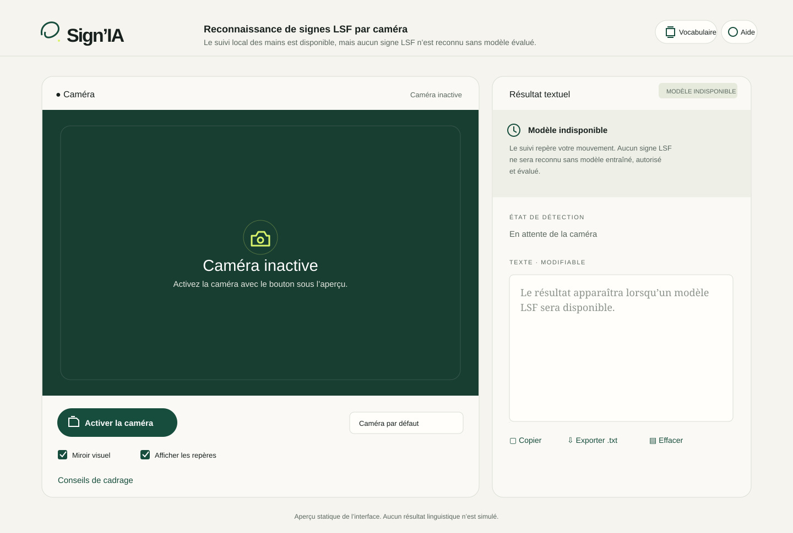

# Sign’IA

Sign’IA est une application web expérimentale de reconnaissance de **signes isolés** en langue des signes française (LSF). Elle compare localement les mouvements de la caméra à des références temporelles avec DTW. Elle ne traduit ni les phrases ni les conversations.



La caméra démarre uniquement sur demande. MediaPipe détecte les repères dans un Web Worker ; les images ne sont ni enregistrées ni envoyées à un serveur. L’utilisateur peut corriger, copier et exporter le texte, ou calibrer un signe avec au moins trois prises conservées sur son appareil. Quelques patrons locaux proposent une mise en forme des libellés confirmés, à relire avant usage.

## Démarrer avec Docker

Prérequis : Docker avec un moteur en cours d’exécution et une connexion Internet pendant le build. Depuis la racine du dépôt :

```sh
docker build -t signia:local .
docker run --rm -p 127.0.0.1:8080:8080 signia:local
```

Ouvrir **http://localhost:8080/**. Arrêter le conteneur avec `Ctrl+C`. Aucun fichier `.env`, compte ou backend n’est nécessaire. Le build installe les dépendances avec `npm ci`, télécharge les modèles MediaPipe, vérifie leurs empreintes SHA-256 définies dans `assets-lock.json`, puis produit le site statique servi par Nginx. Le modèle LSF dérivé est déjà inclus dans le dépôt : le corpus vidéo et Python ne sont pas nécessaires pour construire l’image.

La caméra fonctionne sur `localhost`. Pour accéder au conteneur depuis un autre appareil, placer un proxy **HTTPS** devant le port 8080 : les navigateurs exigent un contexte sécurisé pour l’accès caméra. L’application n’a pas de backend ; toutes les ressources de suivi et de reconnaissance sont servies depuis l’image.

## Développement et build sans Docker

Node.js **24 LTS** est la version utilisée en CI. Depuis la racine :

```sh
npm ci
npm run assets
npm run dev
```

Ouvrir l’adresse indiquée par Vite. Pour produire le site statique dans `dist/` :

```sh
npm test
npm run build
```

`npm run assets` récupère les modèles MediaPipe et les bibliothèques WASM nécessaires. Il vérifie les empreintes fixées dans `assets-lock.json` et échoue si un fichier diffère. Pour les tests navigateur, laisser `npm run dev` actif dans un terminal, puis exécuter dans un autre :

```sh
npx playwright install chromium
npm run test:e2e
```

Les tests navigateur utilisent une caméra synthétique : ils vérifient le logiciel, pas la justesse des signes.

## Fonctionnement et données

L’application est une SPA React/Vite sans backend. Le suivi MediaPipe fonctionne dans un Web Worker ; huit instants d’une fenêtre caméra de 32 images sont comparés par DTW aux références. Les pistes vidéo et le worker sont libérés à l’arrêt ou à la fermeture. Les exemples personnels restent sur l’appareil. Voir [l’architecture](docs/ARCHITECTURE.md).

Le modèle livré contient **1 024 classes**, avec au plus une vidéo de référence par classe. Le corpus `lsf-data` utilisé localement comporte 1 131 vidéos pour 1 141 libellés ; neuf références manquent, un alias partage un clip et 107 clips n’ont pas produit de fenêtre complète exploitable. Les vidéos ne sont pas intégrées au dépôt. Leurs licences individuelles ne sont pas établies par les métadonnées amont ; lire [les sources et réserves de droits](docs/DATA.md) avant toute réutilisation du corpus.

La reconstruction du modèle LSF est **facultative** pour le build. Si vous disposez du corpus autorisé, installez les dépendances Python, adaptez les chemins, puis régénérez les références :

```powershell
python -m pip install -r ml/requirements-single-example.txt
$dataset = "C:\chemin\vers\lsf-data"
python ml/train_single_example.py --dataset-root $dataset --vocabulary (Join-Path $dataset "vocabulaire.json") --model-dir frontend/public/models --cache-dir .cache/lsf-single-example
npm run build
```

Le script met les repères intermédiaires en cache, sans écrire de vidéo, et produit les références quantifiées, leur manifeste et leur empreinte SHA-256. Pour entraîner puis évaluer un modèle général, il faut plusieurs clips annotés par classe, des identités de signants, les consentements et licences, puis une séparation des signants avant le fenêtrage. `ml/config.example.json` et `ml/schema.py` décrivent ce pipeline ; [le protocole de validation](docs/VALIDATION.md) précise les mesures manquantes.

## Mesures et limites

| Mesure | Résultat |
| --- | --- |
| Clips de référence utilisés | 1 024, un par classe |
| Classes LSF chargées | 1 024 |
| Exactitude et macro-F1 linguistiques | Non mesurées |
| Latence de reconnaissance de bout en bout | Non mesurée |

Les seuils de distance ont été élargis de 45 % et la validation temporelle ramenée à 350 ms pour mieux tolérer le cadrage et le rythme. Leur effet sur les faux positifs n’a pas été mesuré indépendamment. Les tests logiciels contrôlent les distances et le rejet sur des séquences synthétiques ; aucun test linguistique indépendant avec des signants distincts n’a été réalisé. L’indicateur de durée à l’écran concerne la dernière image traitée, pas la latence complète d’un signe. Safari/iOS et Android restent à vérifier sur appareils réels.

## Déploiement GitHub Pages

Le workflow [`.github/workflows/pages.yml`](.github/workflows/pages.yml) publie `dist/` à chaque push sur `main`. Dans les paramètres du dépôt, choisir **Pages → GitHub Actions** comme source. Le site sera disponible à **https://evanguennou29.github.io/SignIA/** après un déploiement réussi. La CI vérifie aussi les tests, le build Vite et le build Docker sur les pull requests.

Le build Pages utilise le préfixe `/SignIA/` ; Docker et le build local utilisent `/`. L’image Docker sert l’application à la racine du domaine. Le modèle LSF dérivé est inclus, mais pas les vidéos du corpus.

## Licences

Le code Sign’IA est sous [licence MIT](LICENSE). Les dépendances et modèles de suivi gardent leurs licences et notices amont, répertoriées dans `frontend/public/third-party-licenses.txt` et [docs/DATA.md](docs/DATA.md).
